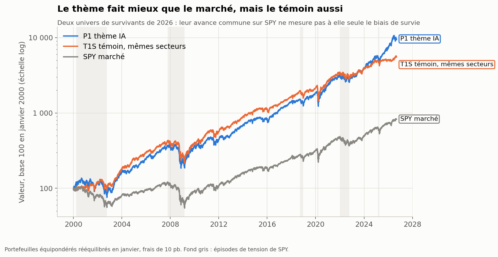
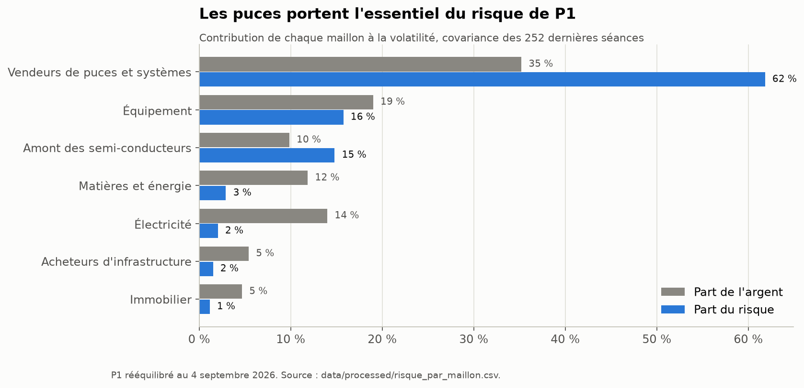
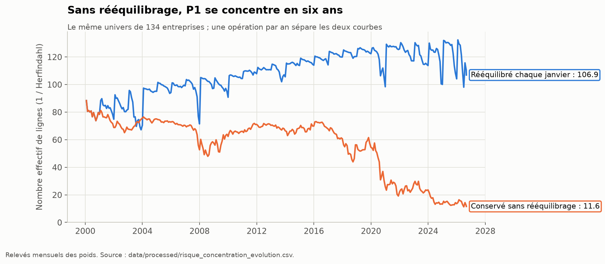
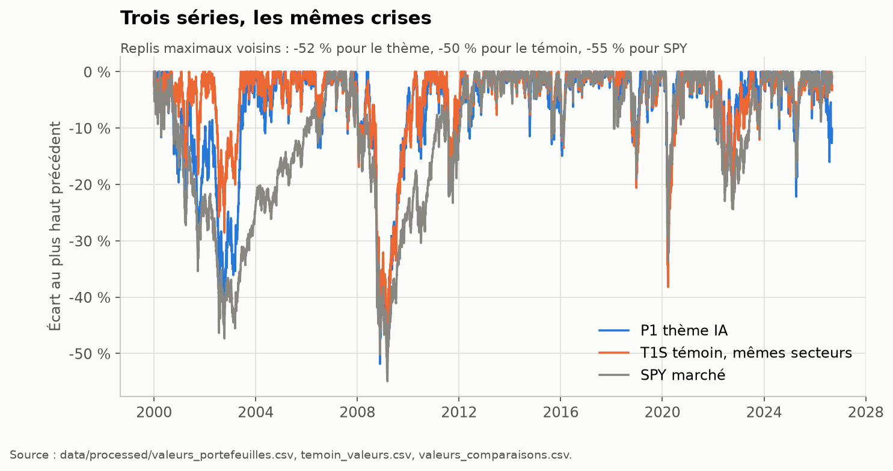
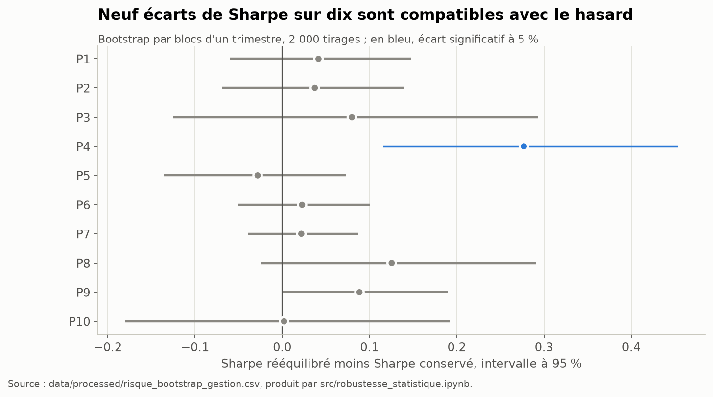

# AI Concentration Risk Research

Je construis un univers documenté de 134 entreprises du S&P 500 exposées à la chaîne des infrastructures de calcul liées à l'IA, puis je mesure le risque des portefeuilles qu'on peut en tirer depuis 2000 et je le compare à celui des 366 autres entreprises de l'indice construites de la même façon.

## Ce que le projet établit



1. **Le thème est plus risqué que le reste du marché, à secteurs égaux.** Sa volatilité dépasse de 2,2 points celle d'un témoin de 366 entreprises repondéré aux mêmes secteurs ; l'écart est significatif.
2. **Il n'est pas démontré qu'il rémunère mieux ce risque.** Son ratio de Sharpe ne se distingue pas de celui du témoin, et l'essentiel de sa performance face à `SPY` se retrouve chez le témoin : c'est le biais de survie d'un univers choisi en 2026, pas l'IA.
3. **Le risque du thème est celui des puces.** Les semi-conducteurs détiennent 45 % de l'argent et portent 77 % du risque ; l'électricité détient 14 % et en porte 2 %.
4. **Sans rééquilibrage, le portefeuille se concentre en six ans.** De fin 2019 à 2026, son nombre effectif de lignes passe de 54 à 11,6.
5. **Le rééquilibrage réduit le risque, mais son avantage de rendement ajusté n'est pas établi.** La baisse de volatilité est significative sur huit portefeuilles sur dix, l'écart de Sharpe sur un seul.
6. **À risque égal, seules les obligations du Trésor intermédiaires ont fait mieux qu'une simple vente d'actions, et seulement jusqu'en 2021.** Les contrats à terme sur l'indice n'ajoutent rien à risque égal ; le verdict sur les puts dépend d'un prix d'option que je n'observe pas.
7. **La couverture par l'indice ne couvre pas le thème.** Une fois le marché retiré, les puces portent 82 % du risque restant de `P1`.

Le rapport d'ensemble est [research/rapport_final.md](research/rapport_final.md). Les étapes 4 et 5 et le portefeuille P11 ont été menés sur des décisions déléguées par l'auteur, écrites comme des propositions à relire.

| | |
|---|---|
|  |  |
|  |  |

Le détail, les chiffres et leurs limites sont dans [les résultats de l'étape 3](research/resultats_risque.md), section XI pour le témoin et les tests statistiques. La question de recherche proposée est dans le [Research Charter](research/research_charter.md), blocs 2 et 3, à valider.

**Ce que ces résultats ne disent pas.** Aucune performance n'est réalisable : l'univers n'était pas connaissable en 2000. Aucune causalité n'est établie entre l'IA et le risque mesuré. Un risque mesuré est un risque passé.

## Reproduire les résultats

```powershell
python -m pip install -r requirements.txt
python -B -m src.construire_portefeuilles --check-only   # vérifie l'étape 2 sans recalcul
python -B -m src.construire_temoin                        # groupe témoin, hors réseau
python -B -m unittest discover -s tests -v
```

Les carnets de l'étape 3 s'exécutent ensuite dans Jupyter, dans cet ordre : `src/mesurer_risque.ipynb`, `src/robustesse_statistique.ipynb`, `src/figures.ipynb`. Ils appellent les fonctions testées de `src/risque.py`.

L'étape 4 demande une collecte (`python -B -m src.collecter_couverture`, déjà faite : les fichiers présents ne sont pas retéléchargés), puis `src/couvrir_diversifier.ipynb`. L'étape 5 et P11 s'exécutent ensuite : `src/comparer_strategies.ipynb`, `src/portefeuille_avenir.ipynb`. Ils appellent `src/couverture.py`, testé dans `tests/test_couverture.py`.

Les empreintes des fichiers sont vérifiées aux fins de ligne près : un dépôt extrait sous Windows, macOS ou Linux passe les mêmes contrôles (`src/empreintes.py`).

**Le corpus des rapports SEC n'est pas dans le dépôt.** `data/raw/filings_text/` pèse 2,5 Go et reste exclu par `.gitignore`. Il n'est nécessaire qu'à l'étape 1 (`src/run_pipeline.py` et `tests/test_integrite_corpus.py`) ; les étapes 2 et 3 se reproduisent sans lui. Pour le rendre accessible, le déposer compressé sur [Zenodo](https://zenodo.org), qui attribue un DOI citable, ou en pièce jointe d'une Release GitHub ; `data/raw/filings_manifest.json` et les empreintes de `filings_termes.csv` permettent de vérifier qu'il s'agit du bon corpus.

## Historique du projet

L'étape 1 prépare les sources, les décisions et les comptes. L'étape 2 produit les trajectoires rétrospectives et leurs contrôles ; le [complément de vérification](research/verification_etape_2.md) donne les corrections de prix, la comparaison Nasdaq et sa couverture réelle. L'étape 3 mesure le risque, ses sources et son comportement en crise.

## Lire le projet

- [Résultats de l'étape 3 : risque, témoin et tests statistiques](research/resultats_risque.md)
- [Research Charter — bloc 1 sourcé, blocs 2 et 3 proposés](research/research_charter.md)
- [Règles de construction des portefeuilles](research/portefeuilles.md)
- [Plan du projet et décisions datées](research/plan_projet.md)
- [Règle de sélection, version III](research/selection_rule.md)
- [Univers et interprétation des résultats](research/univers_selection.md)
- [Erreurs rencontrées et raisons des corrections](research/corrections_2026-09-05.md)
- [Chiffres recalculés](data/processed/synthese_resultats.md)
- [Notes de travail et contexte pédagogique](research/master_context.md)

La rédaction de recherche explique mon raisonnement. Les nombres courants sont produits depuis les fichiers ; les anciens états sont conservés dans `research/archive/2026-09-05_avant_corrections/`.

## Étape 1 : reproduire les calculs sans réseau

Environnement de référence actuel : Python 3.13.9 ; le replay de l'étape 2 a aussi été vérifié sous Python 3.12.14. Les versions des bibliothèques sont fixées dans `requirements.txt`. Les collectes SEC utilisent la bibliothèque standard Python, celle des prix utilise yfinance ; les tests utilisent `unittest`.

Après installation des dépendances dans un environnement Python :

```powershell
python -m pip install -r requirements.txt
python -B src/run_pipeline.py
python -B -m unittest discover -s tests -v
python -B src/run_pipeline.py --check-only
```

Le pipeline vérifie d'abord les empreintes du corpus, puis reconstruit le classement, applique le registre de décisions, traite les comptes, recalcule les alertes et décrit les mouvements comptables. Il termine par les contrôles entre fichiers et un manifeste d'entrées/sorties.

`--check-only` vérifie les données présentes et leurs empreintes, sans les recalculer. Une modification d'une entrée, d'un script de calcul ou d'une sortie depuis l'exécution est signalée. L'export Excel est une opération séparée. `pipeline_status.json` indique si la dernière exécution s'est terminée ; un échec ne doit pas être présenté comme une génération complète.

## Comprendre les données

| Dossier ou fichier | Rôle |
|---|---|
| `data/raw/sp500_constituents.csv` | Composition locale de l'indice, source secondaire à rapprocher d'une source officielle datée |
| `data/raw/sec_facts_raw.csv` | Valeurs comptables acquises, avec notions, dates et dépôts |
| `data/raw/filings_text/` | Rapports HTML, textes, métadonnées, empreintes et générations du corpus |
| `data/raw/filings_termes.csv` | Occurrences et couverture de chaque entreprise |
| `data/raw/filings_phrases.csv` | Passages et positions permettant de revenir au rapport |
| `data/raw/filings_manifest.json` | Empreintes des CSV documentaires de la génération |
| `data/review/decisions_selection.csv` | Décisions documentées par CIK ; source de la classification |
| `data/review/comptabilite_exceptions.json` | Rapprochements comptables et compléments officiels, avec justification |
| `data/processed/` | Résultats reconstruits, contrôles, synthèse et manifeste |

Les CSV sont encodés en UTF-8. Le CIK doit être lu comme du texte de dix caractères. Une entreprise peut avoir plusieurs symboles. Dans les comptes, la clé est le CIK et la date de clôture ; l'année civile majoritaire est informative et peut se répéter.

Le schéma accepte `ENTRE`, `SORT`, `DOUTEUX` et `A_EXAMINER`. La version close ne contient que 134 ENTRE et 366 SORT. Après lecture, une preuve insuffisante a été motivée en SORT selon la consigne de clôture. Une preuve devenue introuvable lors d’un futur recalcul est toujours remise à examiner, sans exclusion automatique. Les décisions sont éditées dans le registre de revue, jamais dans un classement généré.

Les montants non rapprochés restent visibles avec un statut. Une valeur manquante n'est pas zéro. Le fichier `corroboration_details.csv` contient les montants, périodes, périmètres et sources de chaque comparaison ; `corroboration.csv` sépare le mouvement de la couverture.

## Actualiser les sources

Pour reconstruire les passages depuis les rapports déjà archivés, sans réseau :

```powershell
python -B src/fetch_filings_text.py
python -B src/run_pipeline.py
```

Pour consulter de nouveau les dépôts SEC :

```powershell
python -B src/fetch_filings_text.py --refresh
```

`--refresh --resume` reprend une collecte avec les métadonnées déjà récupérées. Cette option sert à terminer une collecte interrompue ; elle ne garantit pas une nouvelle interrogation de toutes les métadonnées.

La collecte financière reste une commande séparée :

```powershell
python -B src/fetch_sec_financials.py
```

Les accès SEC emploient un identifiant de recherche et un rythme limité, définis dans les collecteurs. Une actualisation peut changer la composition ou les dépôts utilisés. Il faut ensuite refaire la revue des preuves invalidées et relancer le pipeline. Un rapport manquant ou une erreur réseau reste consigné ; les succès documentaires antérieurs sont conservés.

Les chiffres comptables courants ont été retraités depuis le brut existant et complétés sur des sources ciblées. Une nouvelle collecte financière intégrale n'a pas été nécessaire à cette correction.

## Export Excel

L'export courant se trouve dans `outputs/01a0708c-acb3-72c2-885a-9b76b6070a14/univers_retenu.xlsx`. Il conserve les trois vues de l'ancien classeur, ajoute les preuves et la couverture, et propose un récapitulatif recalculé.

```powershell
python -B src/export_univers_excel.py
```

L'écriture XLSX nécessite Node.js et le module `@oai/artifact-tool` disponible dans l'environnement. Les variables `NODE_EXECUTABLE` et `ARTIFACT_TOOL_MODULE` permettent de désigner un runtime et un module déjà installés. La préparation seule reste disponible sans ce moteur :

```powershell
python -B src/export_univers_excel.py --json-only
```

Le fichier racine `univers_82.xlsx` est conservé comme état antérieur et n'est plus la sortie courante. Le nouveau nom ne fige pas le nombre d'entreprises.

La première date issue du fichier Yahoo existant est une date d'historique disponible, dont la collecte d'origine n'est pas datée. Elle n'est pas une date d'IPO vérifiée. Les nouveaux candidats sans cette information restent sans date.

## Ce que cette étape ne démontre pas

Les derniers rapports, la composition actuelle et les comptes retraités décrivent une photographie du projet. Ils ne constituent pas un univers historique investissable sans anticipation.

Une exposition économique documentée ne démontre ni une corrélation boursière, ni une causalité entre l'IA et la croissance totale. Les motifs d’exclusion pour preuve insuffisante, les données absentes et les limites de comparabilité restent dans les résultats.

Les tests contrôlent des erreurs précises et la cohérence des artefacts. Ils ne remplacent pas la lecture critique des sources et ne certifient pas l'absence de toute erreur.


## Étape 2 : reconstruction des portefeuilles

L’univers courant comprend 134 entreprises et 135 titres. Les étapes 1 et 2 sont closes pour cette version, selon la règle d’arrêt de l’auteur et sous les limites écrites. Dix groupes sont calculés dans deux modes de gestion. Le [rapport de finition](research/finition_etapes_1_et_2.md) conserve l'état avant A-08. L’[application des décisions du 8 septembre](research/decisions_auteur_2026-09-08.md) donne l'état courant après réexamen et reconstruction.

Les règles courantes sont dans [Portefeuilles](research/portefeuilles.md), la progression dans [Plan du projet](research/plan_projet.md). Le notebook de construction appelle le même traitement local que ces commandes, sans collecte :

```powershell
python -B -m src.construire_portefeuilles
python -B -m src.construire_portefeuilles --check-only
python -B -m unittest discover -s tests -v
```

Les versions de référence sont celles de `requirements.txt`, avec Python 3.13.9 ; la version effectivement utilisée est enregistrée dans chaque manifeste. `--output` permet une reconstruction dans un autre dossier et `--cout` une sensibilité du coût unitaire. Les manifestes vérifient les fichiers locaux ; ils ne garantissent pas qu'une nouvelle interrogation de Yahoo redonnera le même cliché.

Les CSV de prix, benchmarks, calendrier et métadonnées du cliché sont nécessaires à cette reconstruction. Le corpus documentaire de l'étape 1 comporte des caches locaux dont la disponibilité dans un clone doit être contrôlée séparément ; le succès local n'est pas une promesse de reconstitution du corpus intégral par une collecte future.

Le carnet de collecte conserve la démarche d'acquisition, mais bloque la collecte ordinaire si le manifeste existe. Pour consulter ou recalculer le cliché, utiliser les carnets de contrôle et de construction. Les preuves brutes ne sont pas réécrites lors de ces opérations.
