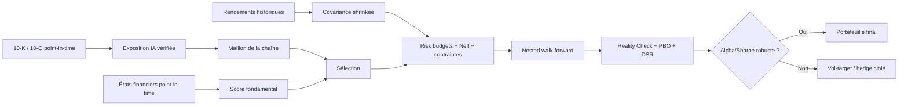

# Revue de littérature en finance empirique : sélection fondamentale, concentration du risque et couverture d’un portefeuille d’infrastructure IA

## Résumé exécutif

Cette revue retient **50 références**, réparties exactement selon les neuf blocs demandés : 6 sur diversification/corrélation, 8 sur construction de portefeuille, 5 sur surapprentissage, 8 sur analyse fondamentale, 5 sur l’articulation fondamentaux–construction, 5 sur risque de queue et volatilité, 6 sur couverture, 4 sur bulles/thématiques/biais de survie et 3 travaux récents sur les actions exposées à l’IA. **Quarante-huit sont des publications et deux sont explicitement signalées comme documents de travail/prépublications de 2026.** Le corpus privilégie les articles de revue et les pages éditeur/DOI ; la littérature primaire pertinente est très majoritairement anglophone.

La conclusion la plus importante pour votre projet est que **votre problème n’est plus un problème classique de diversification par augmentation du nombre de titres**. Avec 135 lignes mais un nombre effectif de seulement 2,92, et avec le maillon « puces » représentant 77 % du risque pour 45 % du poids, votre objet économique est plutôt un portefeuille de quelques paris communs, habillés sous la forme de nombreuses actions. La littérature classique prévoit précisément que le bénéfice marginal d’ajouter des titres disparaît lorsque la composante commune de covariance domine. citeturn8search2turn6search17turn9view0

La deuxième conclusion est qu'il serait difficile de justifier une **optimisation moyenne–variance traditionnelle reposant sur des rendements espérés estimés**. DeMiguel, Garlappi et Uppal comparent 14 modèles sur sept jeux de données et ne trouvent aucune méthode qui domine systématiquement l’équipondération hors échantillon. Les travaux de Jagannathan–Ma, Ledoit–Wolf et DeMiguel et al. montrent en revanche qu’une optimisation portant essentiellement sur le **risque**, fortement régularisée et contrainte, est beaucoup plus défendable. citeturn16search0turn16search20turn16search5turn17search9

La troisième conclusion est que votre future sélection fondamentale ne devrait pas chercher à « prédire Nvidia avant Nvidia », mais à **modifier les probabilités** : favoriser les sociétés profitables, capables de convertir leurs bénéfices en cash, disciplinées dans leur investissement et achetées à une valorisation raisonnable. La profitabilité, l’investissement, la qualité et la valorisation disposent d’une littérature beaucoup plus robuste que des dizaines de ratios ad hoc. Fama–French, Novy-Marx, Piotroski et Cooper–Gulen–Schill constituent ici les références structurantes. citeturn19search0turn19search4turn18search2turn18search22turn18search15turn19search9

La quatrième conclusion concerne directement la contribution potentielle du mémoire : **les briques existent séparément, mais leur combinaison exacte ne ressort pas du corpus examiné**. Il existe des univers d’actions IA définis à partir des 10-K, des modèles intégrant des caractéristiques de firmes dans la construction des poids, de la parité des risques, du minimum-variance et des méthodes de correction du data snooping. En revanche, je n’ai pas identifié dans ce corpus une étude qui définisse un univers d’**infrastructure physique de calcul IA à partir des déclarations des entreprises**, le subdivise en **puces, équipements, réseau, électricité, refroidissement, construction/immobilier**, mesure la **contribution au risque par maillon**, puis combine **analyse fondamentale + budget de risque par maillon + contrôle du nombre effectif + validation hors échantillon corrigée du nombre d’essais**. Le travail d’Ante et Saggu constitue toutefois un précédent important : il faut donc éviter de revendiquer comme nouveauté le simple fait d’utiliser les 10-K pour définir une exposition IA. citeturn22search0turn22search4turn22search8

Enfin, une réserve méthodologique doit passer avant toute recherche de stratégie. **Avec uniquement la composition 2026 du S&P 500 et une classification contemporaine de l’exposition IA, un backtest 2000–2026 ne peut pas être intégralement hors échantillon**, même si ses poids sont calculés en walk-forward. L’univers lui-même contient de l’information future et du biais de survie. Un témoin construit parmi les mêmes survivants est excellent pour isoler une partie de l’effet relatif « thème contre non-thème », mais ne restaure pas la performance absolue que l’investisseur de 2000 aurait pu réaliser. La littérature sur le survivorship bias montre précisément que l’exclusion rétrospective des disparus peut altérer performances et inférences. citeturn1search7turn1search1

| Bloc de littérature | Articles retenus |
|---|---:|
| Diversification, corrélation, concentration | 6 |
| Construction, optimisation, covariance | 8 |
| Surapprentissage et tests multiples | 5 |
| Analyse fondamentale | 8 |
| Fondamentaux + construction fondée sur le risque | 5 |
| Risque de queue, VaR, GARCH | 5 |
| Couverture | 6 |
| Bulles, investissement thématique, survivorship bias | 4 |
| Actions exposées à l’IA | 3 |
| **Total** | **50** |

Le **PDF complet**, qui contient les **50 fiches article par article avec les sept rubriques demandées** — référence, statut, question, données/méthode, résultat, limites et conséquence pour votre projet — est fourni dans la dernière section.

## État de l’art par thème

**Diversification, corrélation et concentration du risque.** Markowitz établit que la diversification est une propriété de la matrice de covariance, pas du seul nombre de lignes. Evans–Archer puis Elton–Gruber montrent que la réduction du risque idiosyncratique devient rapidement marginale à mesure que le nombre de titres augmente. Campbell et al. ajoutent que les composantes marché, industrie et firme de la volatilité peuvent évoluer différemment dans le temps. Pour votre résultat de 2,92 titres indépendants, la lecture correcte est donc : votre portefeuille est nominalement diversifié, mais économiquement concentré sur quelques moteurs communs. citeturn8search2turn8search6turn6search17turn6search7

Forbes et Rigobon sont particulièrement importants pour votre résultat de crise. Ils montrent qu'une hausse de la variance du marché peut, à elle seule, augmenter la corrélation conditionnelle mesurée. Après correction de cette hétéroscédasticité, ils trouvent très peu de preuves d’une hausse de la corrélation inconditionnelle dans les crises asiatique de 1997, mexicaine de 1994 et le krach américain de 1987. Votre constat — absence de hausse après correction pour 10 séries sur 11 — est donc parfaitement cohérent avec leur mécanisme. Ce résultat ne prouve toutefois pas qu’aucune structure de dépendance ne change : bêtas, facteurs communs, dépendance de queue et relations non linéaires peuvent évoluer autrement qu’à travers cette corrélation corrigée. citeturn9view3

**Construction de portefeuille et covariance.** C’est probablement le corpus le plus décisif pour le mémoire. DeMiguel, Garlappi et Uppal établissent qu’aucune des 14 méthodes évaluées ne domine systématiquement 1/N hors échantillon. Jagannathan et Ma expliquent pourquoi des contraintes apparemment « mauvaises », telles que l’interdiction des ventes à découvert, peuvent améliorer la performance réalisée : elles régularisent implicitement l’erreur d’estimation. Ledoit et Wolf proposent précisément un estimateur shrinké mieux conditionné que la covariance empirique en grande dimension. citeturn16search0turn16search20turn16search5turn16search13turn17search9

Pour votre univers, cela conduit à une règle simple : **ne pas optimiser agressivement les rendements attendus ; optimiser prudemment le risque**. Une covariance Ledoit–Wolf, des contraintes long-only, un poids maximal, une contrainte de turnover et surtout une contrainte de contribution au risque du maillon puces sont beaucoup plus justifiables qu’un Markowitz sans régularisation. La parité des risques de Maillard, Roncalli et Teïletche constitue un autre benchmark pertinent : elle égalise mécaniquement les contributions au risque et se situe, sous les conditions étudiées, entre équipondération et minimum-variance en matière de volatilité. Elle ne promet cependant aucun alpha. citeturn17search1turn17search9

**Surapprentissage et tests multiples.** La littérature est sans ambiguïté : présenter le t-stat ou le Sharpe de la meilleure stratégie après avoir essayé des dizaines ou centaines de variantes produit une inférence trop optimiste. White construit son Reality Check précisément pour évaluer le meilleur modèle après data snooping ; Sullivan, Timmermann et White appliquent cette logique à un très grand ensemble de règles techniques sur un siècle de données du Dow Jones. citeturn14search8turn15view1

Harvey, Liu et Zhu montrent que le seuil conventionnel \(|t|\approx2\) est beaucoup trop indulgent dans une littérature ayant testé des centaines de facteurs ; leur analyse conduit à des obstacles sensiblement plus élevés, proches de 3 selon les hypothèses. Bailey et al. proposent la **Probability of Backtest Overfitting**, calculable par Combinatorially Symmetric Cross-Validation, tandis que Bailey et López de Prado proposent le **Deflated Sharpe Ratio**, qui corrige simultanément multiplicité et non-normalité. citeturn15view0turn15view3turn14search11

**Analyse fondamentale et sélection.** Les résultats les plus utiles sont remarquablement cohérents avec ce que devrait être un portefeuille d’infrastructure IA : ne pas sélectionner uniquement la croissance narrative. Fama et French établissent l’importance de la valorisation dans les rendements transversaux historiques, puis leur modèle à cinq facteurs incorpore explicitement profitabilité et investissement. citeturn18search8turn19search0turn19search4

Novy-Marx montre que la **profitabilité brute** contient une information prédictive d’un ordre de grandeur comparable à la valeur dans son échantillon et apporte une information complémentaire. Piotroski montre que l’information issue des états financiers peut séparer les entreprises financièrement fortes et faibles au sein d’un univers value ; dans son échantillon, le filtrage des entreprises solides augmente fortement le rendement moyen du portefeuille value. Cooper, Gulen et Schill documentent quant à eux une relation négative robuste entre forte croissance des actifs et rendement futur. citeturn18search2turn18search22turn18search15turn18search19turn19search9

Ces articles donnent une architecture naturelle à votre futur score : **profitabilité + cash conversion/qualité du résultat + discipline d’investissement + bilan + valorisation**, à laquelle votre projet ajoute une information spécifique et potentiellement nouvelle : **part du chiffre d’affaires ou du capex effectivement reliée à l’infrastructure IA**.

**Combinaison des fondamentaux et du risque.** Brandt, Santa-Clara et Valkanov montrent qu’il est possible d’intégrer directement les caractéristiques des entreprises dans une politique de portefeuille. Arnott, Hsu et Moore construisent des pondérations à partir de grandeurs fondamentales plutôt que de capitalisation. Clarke, de Silva et Thorley montrent que des contraintes de construction peuvent empêcher un signal actif de se traduire intégralement en positions. Kelly, Pruitt et Su relient quant à eux les caractéristiques aux covariances et aux expositions factorielles. Autrement dit, la littérature ne considère pas les « fondamentaux » et le « risque » comme deux mondes séparés : la construction détermine combien du signal économique finit réellement dans le portefeuille.

Votre extension naturelle consiste à ajouter une couche absente de ces travaux généraux : **une contrainte de concentration économique par maillon de la chaîne IA**. Dans votre cas, un portefeuille ayant un excellent score fondamental peut rester peu défensif s’il convertit simplement ce score en une exposition encore plus importante au facteur commun semiconducteurs.

**Risque de queue et volatilité conditionnelle.** Le rejet de votre VaR historique à 99 % par Kupiec indique que la fréquence des violations est incompatible avec le modèle de VaR retenu. Mais Kupiec seul ne répond pas à votre deuxième constat, le **regroupement temporel** des pertes. Christoffersen est indispensable parce qu’il ajoute précisément un test d’indépendance des exceptions : un modèle peut obtenir approximativement la bonne proportion de dépassements tout en étant erroné si les exceptions arrivent en grappes.

Bollerslev fournit la réponse naturelle du côté de la volatilité : un GARCH permet à la variance conditionnelle de dépendre des innovations et variances passées. McNeil et Frey combinent ensuite filtrage de la volatilité et Extreme Value Theory pour la queue des résidus standardisés. Pour votre cas, une hiérarchie méthodologique cohérente est donc : **Historical Simulation comme benchmark → Filtered Historical Simulation → GARCH-t ou GJR-GARCH-t → GARCH-EVT**, avec VaR **et** Expected Shortfall, et avec Kupiec **plus** Christoffersen.

**Couverture.** Les options de vente procurent une convexité que l’on ne peut généralement pas obtenir gratuitement. Coval et Shumway montrent notamment qu’un portefeuille ATM straddle zéro-bêta de leur échantillon perd environ 3 % par semaine en moyenne ; ce chiffre n’est **pas** le coût d’un protective put et ne doit pas être transposé directement à votre portefeuille, mais il montre à quel point l’assurance contre volatilité/queue peut porter un carry négatif. citeturn21search0turn21search8

Le volatility targeting est probablement votre alternative de couverture la plus intéressante à tester avant de payer continuellement des puts. Moreira et Muir obtiennent de meilleurs résultats ajustés du risque pour plusieurs portefeuilles dont l’exposition est réduite lorsque la variance augmente. Harvey et al., sur plus de 60 actifs et des historiques remontant parfois à 1926, trouvent que l’amélioration du Sharpe est surtout présente pour les actifs risqués, notamment actions et crédit, et beaucoup moins pour obligations, devises et matières premières ; ils documentent également une atténuation de certains risques extrêmes et drawdowns. citeturn21search1turn21search5turn21search9

**Bulles, produits thématiques et biais de survie.** Brunnermeier et Nagel montrent que même des investisseurs sophistiqués peuvent préférer accompagner une bulle plutôt que l’arbitrer immédiatement. Cornell et Damodaran soulignent le problème du « big market delusion » : un marché adressable gigantesque n’implique pas que toutes les entreprises exposées pourront simultanément capturer les rentes implicites dans leurs valorisations. Cela est particulièrement pertinent pour l’IA : la même demande finale de calcul peut se retrouver comptée dans les récits de valorisation du fabricant de puces, de l’équipementier, du réseau, du fournisseur d’électricité, du data center et du développeur immobilier. citeturn1search23turn1search2

Le résultat empirique le plus directement pertinent vient de Ben-David, Franzoni, Kim et Moussawi : les ETF spécialisés qu’ils étudient perdent environ **30 % de performance ajustée du risque au cours de leurs cinq premières années**, phénomène qu’ils relient notamment à la survalorisation initiale des titres sous-jacents. Cela constitue un avertissement très fort contre l’idée « thème économiquement certain = rendement boursier supérieur ». citeturn21search7turn21search15turn21search23

**Actions exposées à l’IA.** Ante et Saggu constituent le précédent le plus proche de votre définition d’univers. Ils analysent les 10-K de **3 395 entreprises cotées au Nasdaq entre 2011 et 2023**, construisent plusieurs mesures d’engagement IA et quatre indices, puis les comparent notamment à 14 ETF IA. Ils trouvent aussi une relation entre engagement IA et rendements anormaux autour du lancement de ChatGPT. Votre innovation ne peut donc pas être « utiliser des rapports annuels pour identifier les entreprises IA » en soi. citeturn22search0turn22search4turn22search8

Deux prépublications de 2026 élargissent encore la frontière. Borri, Liu et Tsyvinski construisent une exposition à l’IA à partir d’un volume massif de consommation de LLM — environ 380 000 milliards de tokens sur plus de 400 modèles selon leur prépublication — et étudient la section transversale des rendements. Shen extrait quatre dimensions de risque IA à partir de 7 787 articles du *Wall Street Journal* de 2016 à 2025 et trouve surtout un résultat robuste pour le facteur lié à la désinformation, avec des alphas mensuels annoncés autour de 0,49–0,57 % pour le portefeuille high-minus-low correspondant. Les deux restent des documents de travail en septembre 2026. citeturn22search5turn22search1turn22search2turn22search6

## Réponses méthodologiques aux questions du projet

**a. Faut-il optimiser, ou l’équipondération fait-elle aussi bien hors échantillon ?**  
Il faut **optimiser seulement si l’optimisation prouve qu’elle vaut son coût statistique**. Votre benchmark zéro doit être le portefeuille équipondéré. DeMiguel, Garlappi et Uppal testent quatorze modèles sur sept jeux de données et ne trouvent aucun modèle dominant systématiquement 1/N hors échantillon. citeturn16search0turn16search20

Cela ne condamne pas l’optimisation. Cela condamne surtout l’estimation agressive de \(\mu\), le vecteur des rendements espérés. Avec 135 titres, je recommande comme hiérarchie :

\[
1/N
\;\rightarrow\;
ERC
\;\rightarrow\;
\text{minimum-variance contraint avec }\hat\Sigma_{LW}
\;\rightarrow\;
\text{score fondamental + optimisation du risque}.
\]

La dernière méthode ne doit être retenue que si elle améliore réellement les résultats nets hors échantillon. Jagannathan–Ma et Ledoit–Wolf expliquent pourquoi contraintes et shrinkage sont susceptibles de rendre cette optimisation beaucoup plus stable. citeturn16search5turn16search13turn17search9

**b. Comment corriger un résultat pour le nombre de stratégies essayées ?**  
Ne jamais présenter uniquement le t-stat ou le Sharpe de la stratégie gagnante. Il faut conserver **toutes** les configurations essayées et appliquer plusieurs contrôles complémentaires : White Reality Check pour la statistique maximale, PBO/CSCV pour estimer le risque de sélectionner un faux gagnant, Deflated Sharpe Ratio pour corriger Sharpe, asymétrie, kurtosis et sélection, et un seuil de significativité plus exigeant inspiré de Harvey–Liu–Zhu. citeturn14search8turn15view1turn15view0turn15view3

L’architecture idéale est un **nested walk-forward**. Les hyperparamètres sont choisis dans une fenêtre interne ; la performance n’est évaluée qu’ensuite sur un bloc externe jamais utilisé pour choisir les règles. Changer ensuite de paramètre parce que le test externe est mauvais transforme ce bloc en données d’entraînement et doit être compté comme un essai supplémentaire.

**c. Comment estimer une covariance stable pour environ 135 titres ?**  
Le premier choix est **Ledoit–Wolf shrinkage** plutôt que la covariance empirique brute. L’article construit précisément un estimateur mieux conditionné pour les situations de grande dimension. citeturn17search9

Je testerais seulement quelques spécifications pré-enregistrées :

\[
\hat\Sigma_{\text{LW}},
\qquad
\hat\Sigma_{\text{factorielle}},
\qquad
\hat\Sigma_{\text{LW,EWMA}}
\]

avec des fenêtres de données prédéfinies et sans chercher ex post la fenêtre parfaite. Le critère de comparaison n’est pas l’ajustement de \(\Sigma\) in-sample, mais la **variance effectivement réalisée hors échantillon** du portefeuille construit avec cette matrice.

La matrice doit ensuite être combinée avec long-only, \(w_i\leq w_{\max}\), pénalité de turnover et, surtout dans votre cas,

\[
RC_{\text{puces}}\leq c,
\]

où \(RC\) représente la contribution au risque.

**d. La parité des risques tient-elle ses promesses ?**  
Elle tient sa promesse **comptable** : empêcher qu’un poids apparemment diversifié cache une contribution au risque extrêmement déséquilibrée. Elle ne promet pas une prime de rendement. Maillard, Roncalli et Teïletche montrent qu’un portefeuille Equal Risk Contribution constitue un compromis entre équipondération et minimum-variance. citeturn17search1turn17search21

Mais l’ERC titre par titre n’est pas suffisant dans votre univers : plusieurs semiconducteurs peuvent partager le même facteur de risque. La version plus intéressante est donc **hiérarchique** :

\[
\text{budget de risque entre maillons}
\quad\rightarrow\quad
\text{budget de risque entre titres du maillon}.
\]

C’est cette architecture qui répond vraiment à votre constat « 45 % du capital en puces = 77 % du risque ».

**e. Peut-on mesurer le biais de survie autrement qu’avec un témoin qui le partage ?**  
Oui, et il faut distinguer deux questions. Votre témoin ayant le même survivorship bias est une excellente manière de répondre à :

> « Parmi les entreprises qui ont survécu jusqu’en 2026, le thème se comporte-t-il différemment d’entreprises comparables qui ont elles aussi survécu ? »

Il ne répond pas à :

> « Quelle performance un investisseur aurait-il réellement obtenue depuis 2000 ? »

Pour la seconde question, il faut reconstruire l’univers **point-in-time** : composition historique du S&P 500, entreprises sorties ou décotées, rendements de delisting et information disponible à la date de sélection. Brown et al. démontrent pourquoi la suppression des entités disparues peut fausser une étude de performance. citeturn1search7turn1search1

Il faudrait aussi reconstruire l’**exposition IA point-in-time** : une entreprise ne doit devenir éligible qu’à partir de la première date où un rapport public permet raisonnablement de la classifier dans la chaîne.

**f. La correction de Forbes et Rigobon est-elle fiable ?**  
Oui pour la question précise à laquelle elle répond : **corriger le biais mécanique de corrélation créé par l’augmentation de la variance dans un régime de crise**. Leur article montre que cette correction peut transformer radicalement l’interprétation des corrélations de crise. citeturn9view3

Non si on lui demande de prouver que « rien ne change en crise ». Elle ne neutralise pas automatiquement changement de bêta, nouveaux facteurs communs, dépendance de queue, asymétries ou ruptures de régime. Votre résultat 10/11 est donc fort, mais je le présenterais comme :

> « Pas de preuve robuste de hausse de la corrélation linéaire après correction du biais d’hétéroscédasticité »

et non comme :

> « Il n’existe aucune contagion ».

Les tests de robustesse naturels sont DCC/corrélations conditionnelles, bêtas dynamiques, copules ou tail dependence, et ruptures structurelles.

**g. Les modèles GARCH sont-ils réellement utilisés en gestion du risque, et quel modèle de VaR employer lorsque les pertes arrivent groupées ?**  
La littérature empirique de gestion du risque les utilise directement : Bollerslev formalise GARCH et McNeil–Frey l’emploient comme filtre de volatilité avant de modéliser les queues extrêmes. Cette revue permet donc de répondre « oui » au sens de méthode académique et appliquée de référence ; elle ne permet pas d’affirmer un taux précis d’adoption dans toutes les institutions financières.

Pour votre cas, je testerais :

\[
\text{HS}
\rightarrow
\text{FHS}
\rightarrow
\text{GARCH(1,1)-t}
\rightarrow
\text{GJR-GARCH-t}
\rightarrow
\text{GARCH-EVT}.
\]

Le test de Kupiec doit être accompagné de **Christoffersen**, car votre problème est précisément le clustering des exceptions. Et l’Expected Shortfall est indispensable : deux modèles peuvent avoir la même fréquence de violations VaR tout en produisant des pertes très différentes une fois la VaR franchie.

**h. Peut-on annualiser la volatilité par \(\sqrt{252}\) lorsque les rendements quotidiens sont autocorrélés ?**  
Pas en général. La relation

\[
\sigma_{\text{annuelle}}=\sqrt{252}\,\sigma_{\text{quotidienne}}
\]

suppose que les autocovariances sont nulles. Lorsque les rendements sont autocorrélés,

\[
\operatorname{Var}\left(\sum_{t=1}^{T}r_t\right)
=
T\gamma_0+
2\sum_{k=1}^{T-1}(T-k)\gamma_k .
\]

Il faut donc soit annualiser avec une **variance de long terme** incorporant les autocovariances, soit agréger réellement les rendements, soit effectuer une prévision de variance multi-horizon. Drost et Nijman montrent précisément que l’agrégation temporelle modifie la dynamique des processus GARCH.

Pour votre mémoire, un très bon test de robustesse serait de publier côte à côte :

\[
\sigma_{\sqrt{252}},
\quad
\sigma_{\text{HAC}},
\quad
\sigma_{\text{réalisée sur rendements annuels/21j/63j}}.
\]

**i. Combien coûte réellement une protection par options de vente ?**  
Il n’existe pas de chiffre universel. Le coût dépend de la maturité, du strike, du roll, du niveau et du skew de volatilité implicite, du spread, de la fréquence de crise et du sous-jacent. Coval–Shumway documentent un carry extrêmement négatif sur certaines positions longues de volatilité — environ −3 % par semaine pour les straddles ATM zéro-bêta qu’ils étudient — mais cela **ne doit pas être interprété comme le coût d’un put protecteur**. citeturn21search0turn21search8

Votre série PPUT permet une première estimation empirique du coût historique d’une protection systématique broad-market. Pour répondre à votre vraie question scientifique, il faudrait obtenir des options sur un proxy semiconducteurs ou sur les principaux contributeurs au risque et calculer :

\[
\text{coût net du hedge}
=
\text{primes + spreads + roll}
-
\text{payoffs reçus}.
\]

Puis rapporter, plutôt que le seul CAGR :

\[
\frac{\text{coût annuel du hedge}}
{\text{points de maximum drawdown évités}}
\]

et

\[
\frac{\text{coût annuel}}
{\text{réduction d'Expected Shortfall}}.
\]

**j. Le pilotage de la volatilité améliore-t-il le rendement ajusté du risque ?**  
La réponse empirique est **souvent oui sur les actifs risqués, mais pas universellement**. Moreira–Muir trouvent des améliorations pour plusieurs portefeuilles, et Harvey et al. trouvent des résultats surtout favorables pour actions et crédit, avec beaucoup moins d’effet sur obligations, changes et matières premières. Ils trouvent également que le ciblage de volatilité peut réduire certains événements extrêmes. citeturn21search1turn21search5turn21search9

Votre univers est donc un cas particulièrement intéressant : sa volatilité est déjà 1,14 fois celle du S&P 500 et cette volatilité est concentrée dans un maillon. Un overlay de vol-targeting peut être moins coûteux qu’une assurance put permanente, mais il sacrifie une partie de la participation aux rebonds très rapides.

**k. Peut-on reconnaître les futurs grands gagnants avant qu’ils le deviennent ?**  
Pas de manière déterministe. La littérature retenue montre que des caractéristiques comme profitabilité, qualité, valorisation et investissement ont des relations moyennes avec les rendements futurs ; elle ne montre pas qu’on puisse identifier avec fiabilité les quelques futures entreprises qui multiplieront leur capitalisation. citeturn19search0turn18search2turn18search22turn19search9

La meilleure formulation scientifique de votre objectif serait donc :

> **augmenter ex ante la probabilité de détenir les entreprises capables de convertir l’investissement IA en rentabilité durable, tout en empêchant ces convictions de concentrer excessivement le risque.**

C’est beaucoup plus défendable que « identifier les prochains grands gagnants ».

**l. Que deviennent les portefeuilles thématiques après l’engouement ?**  
Le signal d’alerte est fort. Ben-David et al. trouvent qu’en moyenne les ETF spécialisés de leur échantillon perdent environ **30 % de performance ajustée du risque dans les cinq années qui suivent leur lancement**, un résultat cohérent avec des lancements après périodes de forte attention et des valorisations initiales élevées. citeturn21search7turn21search15

Cela donne une hypothèse testable pour votre univers : la concentration du risque formée entre 2020 et 2026 pourrait être comparée à une montée simultanée de la valorisation, du capex et de l’attention liée à l’IA. Votre stratégie fondamentale doit précisément permettre de distinguer **croissance économique réelle** et **prix déjà payé pour cette croissance**.

**m. Qu’a-t-on déjà publié sur les actions exposées à l’IA ?**  
Trois approches récentes se distinguent dans le corpus :

| Travail | Définition de l’exposition IA | Résultat utile pour votre projet | Statut au 29/09/2026 |
|---|---|---|---|
| Ante & Saggu | Texte des 10-K, 3 395 sociétés Nasdaq, 2011–2023 | Engagement IA mesurable à partir des filings ; indices IA comparés à 14 ETF | **Publié** citeturn22search0turn22search8 |
| Borri, Liu & Tsyvinski | Consommation réelle de LLM/tokens et exposition des firmes | Facteur d’exposition IA et analyse transversale des rendements | **Prépublication 2026** citeturn22search5turn22search1 |
| Shen | Risques IA extraits de 7 787 articles WSJ, 2016–2025 | Hétérogénéité entre types de risque IA ; facteur misinformation significatif | **Prépublication 2026** citeturn22search2turn22search6 |

Aucun de ces trois travaux ne fait ce que fait exactement votre projet : **cartographier l’infrastructure physique nécessaire au calcul IA par maillon, puis étudier la concentration et la construction du risque à l’intérieur de cette chaîne**. Cette formulation, prudente et limitée au corpus examiné, est beaucoup plus solide qu’une affirmation absolue selon laquelle « personne ne l’a jamais fait ».

## Frontière de contribution scientifique

**Univers défini par exposition déclarée dans les rapports annuels.** Ce n’est plus une nouveauté suffisante à lui seul. Ante et Saggu exploitent déjà les 10-K pour mesurer l’engagement IA. Leur échantillon comporte 3 395 sociétés Nasdaq et leurs textes couvrent 2011–2023. citeturn22search0turn22search4turn22search8

Votre contribution peut toutefois être substantiellement différente si la définition est : **preuve textuelle d’une activité économique concrète dans la chaîne physique de calcul**, et non présence générale d’un vocabulaire IA. La méthodologie devrait conserver pour chaque firme la phrase originale, le filing, la date de dépôt, le maillon attribué et éventuellement le degré de matérialité économique.

**Risque décomposé par maillon de la chaîne d’approvisionnement.** Je n’ai identifié dans le corpus retenu aucun article sur les actions exposées à l’IA qui décompose le risque du portefeuille entre **puces, équipements, réseau, électricité, refroidissement et construction/immobilier**, puis mesure comment cette décomposition évolue dans le temps. Ante–Saggu construit des indices IA ; Borri et al. construit une exposition/facteur IA ; Shen étudie des catégories de risque narratif. Aucun n’effectue votre décomposition économique de la chaîne physique. citeturn22search0turn22search5turn22search2

C’est probablement l’une de vos meilleures pistes de contribution, surtout avec votre résultat déjà très fort : **77 % du risque dans les puces contre seulement 2 % dans l’électricité**.

**Témoin portant le même biais de survie.** La littérature classique établit le problème de survivorship bias, mais le design exact que vous utilisez — comparer le thème à un groupe de contrôle sectoriellement comparable construit à partir du **même ensemble de survivants 2026** — constitue surtout une stratégie d’identification relative. citeturn1search7turn1search1

La bonne présentation est donc :

> le contrôle partagé du biais permet d’éliminer une partie de la différence artificielle thème–témoin, mais ne reconstruit pas le rendement absolu historiquement investissable.

Votre estimation selon laquelle environ 7,6 des 10,35 points d’avance annuelle viennent du biais de survie est alors une découverte empirique propre à votre échantillon, à distinguer du résultat général de la littérature.

**Combinaison analyse financière + concentration mathématique.** Ici, les composants existent déjà : caractéristiques intégrées aux politiques de portefeuille, pondération fondamentale, covariance régularisée, minimum-variance, risk parity et contraintes de portefeuille. La nouveauté ne peut donc pas être simplement « fondamentaux + optimisation ».

La formulation potentiellement nouvelle est beaucoup plus précise :

\[
\boxed{
\text{score fondamental point-in-time}
+
\text{taxonomie économique IA}
+
\text{covariance shrinkée}
+
\text{budget de risque par maillon}
+
\text{contrainte de }N_{\mathrm{eff}}
}
\]

avec validation réellement hors échantillon.

**Recherche systématique de la meilleure construction, corrigée du nombre d’essais.** Tous les outils sont publiés : Reality Check, seuils de tests multiples, PBO et Deflated Sharpe Ratio. citeturn14search8turn15view0turn15view3 Ce qui ne ressort pas du corpus IA examiné est leur application conjointe à une famille complète de constructions de portefeuille thématique IA.

Cela offre une contribution méthodologique d’application très crédible :

> ne pas demander seulement « quelle stratégie gagne ? », mais « la stratégie gagnante continue-t-elle à gagner une fois que l’on tient compte de toutes celles que nous avons essayé de faire gagner ? »

**Protection ciblée du seul maillon portant le risque.** La littérature étudie coût des options, prime de volatilité, momentum/futures et volatility targeting, mais je n’ai pas identifié dans ce corpus une expérience comparant explicitement :

\[
\text{hedge de l'ensemble du portefeuille}
\quad\text{contre}\quad
\text{hedge du seul maillon dominant en contribution au risque}.
\]

C’est une piste particulièrement logique puisque votre risque n’est pas réparti uniformément. Un put S&P 500 peut être une assurance très inefficace si la vraie source du drawdown est un choc semiconducteurs. À l’inverse, un put ciblé peut être excessivement coûteux si le skew implicite du secteur reflète déjà cette demande d’assurance. Seul un test net de primes, spreads et payoffs peut trancher.

La contribution la plus défendable du projet apparaît ainsi comme l’intersection de plusieurs éléments plutôt que comme l’invention d’une brique isolée :



## Stratégies candidates et protocole reproductible

Les stratégies suivantes sont suffisamment différentes économiquement pour constituer des hypothèses de recherche, mais suffisamment peu nombreuses pour ne pas transformer immédiatement le mémoire en exercice de data mining.

| Stratégie candidate | Logique | Données nécessaires | Validation hors échantillon |
|---|---|---|---|
| **Qualité–valorisation + risk budget hiérarchique** | Classer d’abord les entreprises sur profitabilité, cash conversion, qualité, valorisation, investissement et exposition IA ; attribuer ensuite un budget de risque à chaque maillon puis ERC entre titres | Compustat/EDGAR point-in-time, part de CA IA, prix/dividendes, covariance shrinkée | Nested walk-forward ; comparaison à 1/N, ERC simple et témoin ; DSR + PBO + Reality Check |
| **Score fondamental + minimum-variance shrinké** | Sélectionner par exemple 40–70 meilleures entreprises, puis minimiser \(w'\hat\Sigma_{LW}w\) avec long-only, max-weight, plafond de contribution au risque des puces et turnover | Fondamentaux, prix, Ledoit–Wolf, coûts de transaction | Hyperparamètres choisis uniquement dans la boucle interne ; variance/drawdown/ES réalisés sur blocs externes |
| **Quality at a reasonable price + plancher de \(N_{\mathrm{eff}}\)** | Maximiser qualité/valorisation tout en interdisant au portefeuille de devenir économiquement équivalent à quelques titres | Même base fondamentale + mesure explicite de diversification effective | Ablation : score seul, contrainte seule, combinaison ; test de stabilité par régimes |
| **Portefeuille défensif + volatility target + hedge ciblé** | Partir de la meilleure construction robuste ; réduire l’exposition lorsque volatilité/risque monte ; comparer hedge puces à hedge marché | PPUT, options/futures ou proxy semiconducteurs, volatilité implicite, spreads, contributions au risque | Même règle de déclenchement sur tous les blocs ; coût par point de drawdown ou ES évité ; correction de multiplicité |

La **première stratégie** est probablement la plus cohérente avec l’objectif académique. Elle permet de séparer trois décisions souvent confondues :

\[
\underbrace{\text{Quelles entreprises méritent d'être détenues ?}}_{\text{fondamentaux}}
\]

\[
\underbrace{\text{Combien de risque accorder à chaque activité ?}}_{\text{chaîne IA}}
\]

\[
\underbrace{\text{Combien de chaque titre détenir ?}}_{\text{covariance/construction}}
\]

Elle évite ainsi que la sélection fondamentale et la pondération du risque soient déterminées par la même fonction objectif.

La **deuxième stratégie** est le benchmark optimisé le plus propre : aucun rendement espéré n’est nécessaire. Elle teste une hypothèse simple : « une fois les entreprises médiocres éliminées par l’analyse fondamentale, peut-on réduire le risque restant sans perdre le rendement ? » Elle s’appuie directement sur les résultats concernant minimum-variance, régularisation et contraintes. citeturn16search5turn17search9

La **troisième stratégie** est la plus spécifique à votre découverte sur les 2,92 titres indépendants. Il faudra cependant définir précisément \(N_{\mathrm{eff}}\). Par exemple, pour une concentration pure des poids,

\[
N_{\mathrm{eff},w}=
\frac{1}{\sum_i w_i^2},
\]

mais cette quantité ne capture pas les corrélations. Une mesure spectrale ou une mesure calculée à partir des contributions au risque est plus appropriée pour votre question. Je recommanderais d'en préspécifier une principale et d’utiliser les autres uniquement en robustesse.

La **quatrième stratégie** ne doit être testée qu’après les trois premières. Une couverture coûteuse ne devrait pas servir à réparer un portefeuille qui pourrait simplement être mieux construit. Le test pertinent est donc séquentiel :

\[
\text{diversification structurelle}
\rightarrow
\text{vol-targeting}
\rightarrow
\text{hedge optionnel ciblé}.
\]

Harvey et al. fournissent une justification empirique à l’étape volatility targeting ; la littérature sur options rappelle pourquoi l’étape suivante doit être jugée après coût. citeturn21search8turn21search9

**Données à ajouter.** La priorité absolue n’est pas encore une autre série de prix mais les **données point-in-time** nécessaires pour rendre la recherche causalement et historiquement interprétable. La base idéale combinerait CRSP pour rendements et delistings, une source d’historique de composition S&P 500, Compustat North America annual/quarterly, SEC EDGAR/XBRL pour les dates de dépôt et les preuves textuelles, OptionMetrics/CBOE pour le coût réel des couvertures et la Kenneth French Data Library pour les facteurs de contrôle.

Les variables fondamentales minimales devraient rester parcimonieuses :

\[
\text{Gross profitability}
=
\frac{\text{Sales}-\text{COGS}}{\text{Assets}},
\]

ROA/ROIC, marge et stabilité des marges, operating cash flow/net income, accruals, free-cash-flow yield, book-to-market ou earnings yield, asset growth, capex/assets, leverage, interest coverage et, lorsque publiquement identifiable, **AI-related revenue share** ou une mesure analogue de matérialité économique. L’importance de profitabilité et investissement est directement motivée par Fama–French, Novy-Marx et Cooper et al. citeturn19search0turn18search22turn19search9

Le principe crucial est la datation. Une variable du bilan au 31 décembre ne peut pas être supposée connue au marché le 31 décembre. La valeur doit entrer dans le backtest à partir de sa **date de dépôt/publication**, éventuellement avec un délai conservateur.

**Architecture de code recommandée.** En Python, l’ensemble peut être construit avec `pandas` ou `polars`, `numpy`, `scipy`, `statsmodels`, `arch`, `sklearn.covariance.LedoitWolf`, `cvxpy`, `linearmodels` et `pyarrow`. En R, les équivalents utiles incluent `data.table`, `xts`, `PerformanceAnalytics`, `rugarch`, `PortfolioAnalytics`, `sandwich` et `boot`.

Chaque stratégie doit avoir un fichier de configuration immuable de type YAML/JSON :

```yaml
strategy_id: fundamental_hierarchical_risk_v1
fundamental_score:
  profitability: 0.30
  cash_quality: 0.20
  valuation: 0.20
  investment_discipline: 0.15
  ai_revenue_exposure: 0.15

covariance:
  estimator: ledoit_wolf
  lookback_days: 504

constraints:
  long_only: true
  max_stock_weight: 0.05
  max_chip_risk_contribution: 0.35
  turnover_penalty: 0.002

validation:
  external_block: 1_year
  nested_tuning: true
```

Le fichier doit être hashé et archivé avec le résultat. Ainsi, après plusieurs mois de recherche, il reste possible de déterminer si 8, 80 ou 800 variantes ont réellement été essayées — information indispensable au DSR/PBO.

Le protocole principal devrait être :

\[
\boxed{
\text{Nested walk-forward}
+
\text{coûts}
+
\text{point-in-time}
+
\text{journal de tous les essais}
+
\text{Reality Check/PBO/DSR}
}
\]

Avant reconstruction historique de l’univers, les résultats devraient être explicitement désignés comme :

> **« résultats hors échantillon pour les poids, conditionnellement à un univers de survivants observé en 2026 »**

et non comme un authentique backtest investissable depuis 2000.

Un découpage possible du travail de recherche est le suivant ; il s’agit d’un **calendrier méthodologique pour le mémoire**, et non d’une opération restant à exécuter par l’assistant.

| Période du projet | Travail |
|---|---|
| Semaine 1 | Figer taxonomie des maillons et règle de datation de la première exposition IA publiquement observable |
| Semaines 2–3 | Reconstruire constituants historiques du S&P 500, sorties et delistings |
| Semaines 3–5 | Collecter états financiers point-in-time, filings et variables fondamentales |
| Semaine 6 | Pré-enregistrer les familles de stratégies et la grille limitée d’hyperparamètres |
| Semaines 7–8 | Backtests walk-forward imbriqués, coûts, turnover et analyses d’ablation |
| Semaine 9 | Reality Check, PBO, DSR, robustesse par sous-périodes et régimes |
| Semaine 10 | Comparaison volatility targeting, PPUT, hedge ciblé ; rédaction des résultats définitifs |

## Corpus retenu, références et rapport PDF

Le tableau suivant constitue la bibliographie de travail. Les **deux seules entrées non publiées** sont clairement signalées comme prépublications. Les cinquante fiches détaillées avec question, échantillon, méthode, résultat quantitatif, limites et implication pour votre projet sont intégrées au PDF.

| # | Référence | Statut | Thème | Source |
|---:|---|---|---|---|
| 1 | Markowitz, H. (1952), “Portfolio Selection”, *Journal of Finance* 7(1), 77–91 | Publié | Diversification | [DOI](https://doi.org/10.1111/j.1540-6261.1952.tb01525.x) |
| 2 | Evans, J. L. & Archer, S. H. (1968), “Diversification and the Reduction of Dispersion: An Empirical Analysis”, *Journal of Finance* 23(5), 761–767 | Publié | Diversification | [DOI](https://doi.org/10.1111/j.1540-6261.1968.tb00315.x) |
| 3 | Elton, E. J. & Gruber, M. J. (1977), “Risk Reduction and Portfolio Size: An Analytical Solution”, *Journal of Business* 50(4), 415–437 | Publié | Diversification | [DOI](https://doi.org/10.1086/295964) |
| 4 | Campbell, J. Y., Lettau, M., Malkiel, B. G. & Xu, Y. (2001), “Have Individual Stocks Become More Volatile?”, *Journal of Finance* 56(1), 1–43 | Publié | Diversification | [DOI](https://doi.org/10.1111/0022-1082.00318) |
| 5 | Forbes, K. J. & Rigobon, R. (2002), “No Contagion, Only Interdependence”, *Journal of Finance* 57(5), 2223–2261 | Publié | Corrélation/crises | [DOI](https://doi.org/10.1111/0022-1082.00494) |
| 6 | Goetzmann, W. N. & Kumar, A. (2008), “Equity Portfolio Diversification”, *Review of Finance* 12(3), 433–463 | Publié | Diversification | [DOI](https://doi.org/10.1093/rof/rfn005) |
| 7 | DeMiguel, V., Garlappi, L. & Uppal, R. (2009), “Optimal Versus Naive Diversification”, *Review of Financial Studies* 22(5), 1915–1953 | Publié | Construction | [DOI](https://doi.org/10.1093/rfs/hhm075) |
| 8 | Jagannathan, R. & Ma, T. (2003), “Risk Reduction in Large Portfolios: Why Imposing the Wrong Constraints Helps”, *Journal of Finance* 58(4), 1651–1683 | Publié | Construction | [DOI](https://doi.org/10.1111/1540-6261.00580) |
| 9 | Ledoit, O. & Wolf, M. (2004), “A Well-Conditioned Estimator for Large-Dimensional Covariance Matrices”, *Journal of Multivariate Analysis* 88(2), 365–411 | Publié | Covariance | [DOI](https://doi.org/10.1016/S0047-259X(03)00096-4) |
| 10 | Michaud, R. O. (1989), “The Markowitz Optimization Enigma”, *Financial Analysts Journal* 45(1), 31–42 | Publié | Erreur d’estimation | [DOI](https://doi.org/10.2469/faj.v45.n1.31) |
| 11 | Maillard, S., Roncalli, T. & Teïletche, J. (2010), “The Properties of Equally Weighted Risk Contribution Portfolios”, *Journal of Portfolio Management* 36(4), 60–70 | Publié | Risk parity | [DOI](https://doi.org/10.3905/jpm.2010.36.4.060) |
| 12 | DeMiguel, V., Garlappi, L., Nogales, F. & Uppal, R. (2009), “A Generalized Approach to Portfolio Optimization”, *Management Science* 55(5), 798–812 | Publié | Régularisation | [DOI](https://doi.org/10.1287/mnsc.1080.0986) |
| 13 | Fan, J., Zhang, J. & Yu, K. (2012), “Vast Portfolio Selection with Gross-Exposure Constraints”, *JASA* 107(498), 592–606 | Publié | Grande dimension | [DOI](https://doi.org/10.1080/01621459.2012.682825) |
| 14 | Clarke, R., de Silva, H. & Thorley, S. (2006), “Minimum-Variance Portfolios in the U.S. Equity Market”, *Journal of Portfolio Management* 33(1), 10–24 | Publié | Minimum-variance | [DOI](https://doi.org/10.3905/jpm.2006.661366) |
| 15 | White, H. (2000), “A Reality Check for Data Snooping”, *Econometrica* 68(5), 1097–1126 | Publié | Backtest | [DOI](https://doi.org/10.1111/1468-0262.00152) |
| 16 | Sullivan, R., Timmermann, A. & White, H. (1999), “Data-Snooping, Technical Trading Rule Performance, and the Bootstrap”, *Journal of Finance* 54(5), 1647–1691 | Publié | Backtest | [DOI](https://doi.org/10.1111/0022-1082.00163) |
| 17 | Harvey, C. R., Liu, Y. & Zhu, H. (2016), “… and the Cross-Section of Expected Returns”, *Review of Financial Studies* 29(1), 5–68 | Publié | Tests multiples | [DOI](https://doi.org/10.1093/rfs/hhv059) |
| 18 | Bailey, D. H., Borwein, J., López de Prado, M. & Zhu, Q. (2016), “The Probability of Backtest Overfitting”, *Journal of Computational Finance* 20(4) | Publié | PBO | [DOI](https://doi.org/10.21314/JCF.2016.322) |
| 19 | Bailey, D. H. & López de Prado, M. (2014), “The Deflated Sharpe Ratio”, *Journal of Portfolio Management* 40(5), 94–107 | Publié | DSR | [DOI](https://doi.org/10.3905/jpm.2014.40.5.094) |
| 20 | Fama, E. F. & French, K. R. (1992), “The Cross-Section of Expected Stock Returns”, *Journal of Finance* 47(2), 427–465 | Publié | Fondamentaux | [DOI](https://doi.org/10.1111/j.1540-6261.1992.tb04398.x) |
| 21 | Fama, E. F. & French, K. R. (2015), “A Five-Factor Asset Pricing Model”, *Journal of Financial Economics* 116(1), 1–22 | Publié | Profitabilité/investissement | [DOI](https://doi.org/10.1016/j.jfineco.2014.10.010) |
| 22 | Novy-Marx, R. (2013), “The Other Side of Value: The Gross Profitability Premium”, *Journal of Financial Economics* 108(1), 1–28 | Publié | Profitabilité | [DOI](https://doi.org/10.1016/j.jfineco.2013.01.003) |
| 23 | Piotroski, J. D. (2000), “Value Investing: The Use of Historical Financial Statement Information…”, *Journal of Accounting Research* 38, 1–41 | Publié | Signaux comptables | [DOI](https://doi.org/10.2307/2672906) |
| 24 | Sloan, R. G. (1996), “Do Stock Prices Fully Reflect Information in Accruals and Cash Flows…?”, *Accounting Review* 71(3), 289–315 | Publié | Accruals | [DOI](https://doi.org/10.2307/248290) |
| 25 | Cooper, M. J., Gulen, H. & Schill, M. J. (2008), “Asset Growth and the Cross-Section of Stock Returns”, *Journal of Finance* 63(4), 1609–1651 | Publié | Investissement | [DOI](https://doi.org/10.1111/j.1540-6261.2008.01370.x) |
| 26 | Asness, C., Frazzini, A. & Pedersen, L. (2019), “Quality Minus Junk”, *Review of Accounting Studies* 24, 34–112 | Publié | Qualité | [DOI](https://doi.org/10.1007/s11142-018-9470-2) |
| 27 | Green, J., Hand, J. & Zhang, X. F. (2017), “The Characteristics that Provide Independent Information…”, *Review of Financial Studies* 30(12), 4389–4436 | Publié | Signaux | [DOI](https://doi.org/10.1093/rfs/hhx019) |
| 28 | Brandt, M., Santa-Clara, P. & Valkanov, R. (2009), “Parametric Portfolio Policies”, *Review of Financial Studies* 22(9), 3411–3447 | Publié | Fondamentaux + poids | [DOI](https://doi.org/10.1093/rfs/hhn130) |
| 29 | Arnott, R., Hsu, J. & Moore, P. (2005), “Fundamental Indexation”, *Financial Analysts Journal* 61(2), 83–99 | Publié | Pondération fondamentale | [DOI](https://doi.org/10.2469/faj.v61.n2.2718) |
| 30 | Clarke, R., de Silva, H. & Thorley, S. (2002), “Portfolio Constraints and the Fundamental Law of Active Management”, *Financial Analysts Journal* 58(5), 48–66 | Publié | Signaux + contraintes | [DOI](https://doi.org/10.2469/faj.v58.n5.2468) |
| 31 | Kelly, B., Pruitt, S. & Su, Y. (2019), “Characteristics are Covariances”, *Journal of Financial Economics* 134(3), 501–524 | Publié | Caractéristiques/risque | [DOI](https://doi.org/10.1016/j.jfineco.2018.10.009) |
| 32 | Frazzini, A., Kabiller, D. & Pedersen, L. H. (2018), “Buffett’s Alpha”, *Financial Analysts Journal* 74(4), 35–55 | Publié | Qualité + risque | [DOI](https://doi.org/10.2469/faj.v74.n4.3) |
| 33 | Bollerslev, T. (1986), “Generalized Autoregressive Conditional Heteroskedasticity”, *Journal of Econometrics* 31(3), 307–327 | Publié | GARCH | [DOI](https://doi.org/10.1016/0304-4076(86)90063-1) |
| 34 | Kupiec, P. H. (1995), “Techniques for Verifying the Accuracy of Risk Measurement Models”, *Journal of Derivatives* 3(2), 73–84 | Publié | VaR | [DOI](https://doi.org/10.3905/jod.1995.3.2.73) |
| 35 | Christoffersen, P. F. (1998), “Evaluating Interval Forecasts”, *International Economic Review* 39(4), 841–862 | Publié | Validation VaR | [DOI](https://doi.org/10.2307/2527341) |
| 36 | McNeil, A. J. & Frey, R. (2000), “Estimation of Tail-Related Risk Measures…”, *Journal of Empirical Finance* 7(3–4), 271–300 | Publié | GARCH-EVT | [DOI](https://doi.org/10.1016/S0927-5398(00)00012-8) |
| 37 | Drost, F. C. & Nijman, T. E. (1993), “Temporal Aggregation of GARCH Processes”, *Econometrica* 61(4), 909–927 | Publié | Agrégation temporelle | [DOI](https://doi.org/10.2307/2951767) |
| 38 | Coval, J. D. & Shumway, T. (2001), “Expected Option Returns”, *Journal of Finance* 56(3), 983–1009 | Publié | Options | [DOI](https://doi.org/10.1111/0022-1082.00352) |
| 39 | Bondarenko, O. (2014), “Why Are Put Options So Expensive?”, *Quarterly Journal of Finance* 4(3) | Publié | Puts | [DOI](https://doi.org/10.1142/S2010139214500053) |
| 40 | Moreira, A. & Muir, T. (2017), “Volatility-Managed Portfolios”, *Journal of Finance* 72(4), 1611–1644 | Publié | Volatility targeting | [DOI](https://doi.org/10.1111/jofi.12513) |
| 41 | Harvey, C. R. et al. (2018), “The Impact of Volatility Targeting”, *Journal of Portfolio Management* 45(1), 14–33 | Publié | Volatility targeting | [DOI](https://doi.org/10.3905/jpm.2018.45.1.014) |
| 42 | Moskowitz, T., Ooi, Y. & Pedersen, L. (2012), “Time Series Momentum”, *Journal of Financial Economics* 104(2), 228–250 | Publié | Futures/trend | [DOI](https://doi.org/10.1016/j.jfineco.2011.11.003) |
| 43 | Bakshi, G. & Kapadia, N. (2003), “Delta-Hedged Gains and the Negative Market Volatility Risk Premium”, *Review of Financial Studies* 16(2), 527–566 | Publié | Prime de volatilité | [DOI](https://doi.org/10.1093/rfs/16.2.527) |
| 44 | Brown, S., Goetzmann, W., Ibbotson, R. & Ross, S. (1992), “Survivorship Bias in Performance Studies”, *Review of Financial Studies* 5(4), 553–580 | Publié | Biais de survie | [DOI](https://doi.org/10.1093/rfs/5.4.553) |
| 45 | Brunnermeier, M. K. & Nagel, S. (2004), “Hedge Funds and the Technology Bubble”, *Journal of Finance* 59(5), 2013–2040 | Publié | Bulle technologique | [DOI](https://doi.org/10.1111/j.1540-6261.2004.00672.x) |
| 46 | Ben-David, I., Franzoni, F., Kim, B. & Moussawi, R. (2023), “Competition for Attention in the ETF Space”, *Review of Financial Studies* 36(3), 987–1042 | Publié | Investissement thématique | [DOI](https://doi.org/10.1093/rfs/hhac048) |
| 47 | Cornell, B. & Damodaran, A. (2020), “The Big Market Delusion”, *Financial Analysts Journal* 76(2), 15–25 | Publié | Bulles/valorisation | [DOI](https://doi.org/10.1080/0015198X.2020.1730655) |
| 48 | Ante, L. & Saggu, A. (2025), “Quantifying a firm’s AI engagement… using 10-K filings”, *Technological Forecasting and Social Change* 212, 123965 | **Publié** | Actions IA | [DOI](https://doi.org/10.1016/j.techfore.2024.123965) |
| 49 | Borri, N., Liu, Y. & Tsyvinski, A. (2026), “The Cross-Section of Stock Returns and AI Exposure” | **Document de travail / arXiv** | Actions IA | [arXiv](https://arxiv.org/abs/2606.30583) |
| 50 | Shen, Y. (2026), “Are AI Risks Priced in the U.S. Stock Market? Evidence from Financial News Factors” | **Document de travail / arXiv** | Actions IA | [arXiv](https://arxiv.org/abs/2609.05485) |

La revendication de nouveauté devra rester formulée en termes de **« non identifié dans le corpus vérifié »** plutôt que « jamais fait dans toute la littérature », surtout pour les travaux IA de 2025–2026 dont la frontière évolue rapidement. Les trois travaux IA les plus récents montrent déjà que la définition de l’exposition à l’intelligence artificielle devient elle-même un domaine d’asset pricing. citeturn22search0turn22search5turn22search2

Le résultat de recherche le plus prometteur est donc moins « les actions IA surperforment-elles ? » que :

> **Peut-on transformer un thème structurellement concentré en un portefeuille défensif en sélectionnant les entreprises dont les fondamentaux justifient leur exposition à l’IA, puis en imposant que les convictions fondamentales ne se traduisent pas par une concentration excessive des contributions au risque ; et cette amélioration survit-elle à un vrai test point-in-time, aux coûts et à la correction du nombre total de stratégies essayées ?**

C’est une question qui articule directement vos résultats empiriques déjà établis avec Markowitz/Elton–Gruber sur la diversification, Ledoit–Wolf/Jagannathan–Ma sur la construction, Fama–French/Novy-Marx/Piotroski sur les fondamentaux, White/Harvey/Bailey sur le data mining, McNeil–Frey sur les queues, et la littérature toute récente sur les actions exposées à l’IA. citeturn17search9turn19search0turn18search22turn14search8turn15view3turn22search8

**[Télécharger le rapport PDF complet — revue de littérature, 50 fiches détaillées, synthèse méthodologique, stratégies et tableau des références](sandbox:/mnt/data/revue_litterature_finance_empirique_IA_infrastructure_2026-09-29.pdf)**